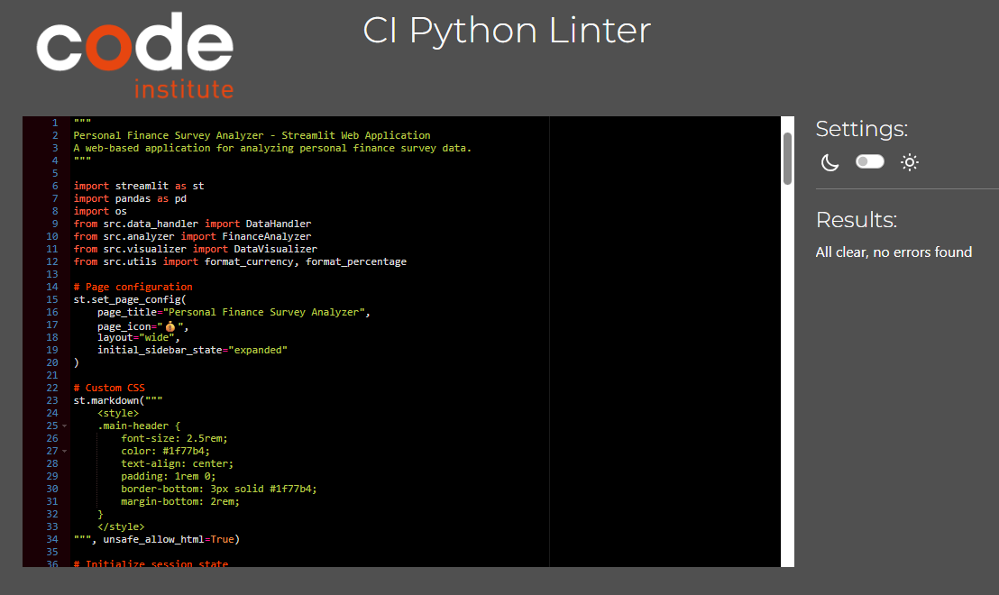
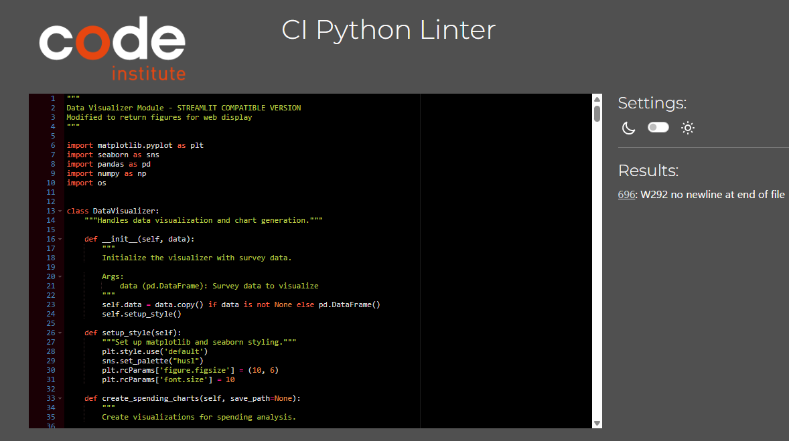

# PERSONAL FINANCE SURVEY ANALYZER

A Python-based command-line & Streamlit application for analyzing personal finance survey data with cloud integration and professional visualizations.

<div align="center">

## 🌐 Live Deployment

<a href="https://money-minde-servey-3397e1a23ed8.herokuapp.com/" target="_blank">
  
</a>

**Platform:** Heroku Cloud | **Status:** 🟢 Online | **Response Time:** < 2s

[](https://github.com/SteveDok22/MoneyMind---Servey/commits/main/)
[](https://github.com/yourusername/personal-finance-analyzer/commits/main)
[](https://github.com/yourusername/personal-finance-analyzer)


---

</div>

<div align="center">


*Personal Finance Survey Analyzer displayed across multiple devices*

</div>

<div align="center">

---

</div>

[](https://github.com/SteveDok22/MoneyMind---Servey/commits/main/)
[](https://github.com/yourusername/personal-finance-analyzer/commits/main)
[](https://github.com/yourusername/personal-finance-analyzer)

---

## 📌 Table of Contents

- [Introduction](#introduction)
- [Project Goals](#project-goals)
- [User Experience (UX)](#user-experience-ux)
- [Code Architecture](#code-architecture)
- [Deployment Architecture](#deployment-architecture)
- [Features](#features)
- [Data Structure](#data-structure)
- [Technologies Used](#technologies-used)
- [Installation & Setup](#installation--setup)
- [Usage Guide](#usage-guide)
- [CLI Screenshot Guide](#cli-screenshot-guide)
- [Development Journey & Challenges](#development-journey--challenges)
- [Testing](#testing)
- [Code Validation](#code-validation)
- [Deployment](#deployment)
- [Code Attribution & Resources](#code-attribution--resources)
- [Known Bugs](#known-bugs)
- [Future Enhancements](#future-enhancements)
- [Credits](#credits)

---

## Introduction

**Personal Finance Survey Analyzer** is a comprehensive Python terminal application designed for researchers, financial analysts, and FinTech companies to analyze consumer financial behavior through survey data. The application provides deep insights into spending patterns, savings behavior, investment preferences, cryptocurrency adoption, and financial literacy levels.

### Key Capabilities

- 📊 **Comprehensive Financial Analysis** - Spending, savings, investments, and crypto adoption metrics
- 💻 **Dual Interface Architecture** - Command-line interface for local use + web interface for cloud deployment
- ☁️ **Cloud Integration** - Optional Google Sheets connectivity for real-time data management
- 📈 **Professional Visualizations** - Publication-ready charts with 300 DPI export quality
- 🔒 **Privacy-Focused** - Local processing option maintains data confidentiality
- 🎯 **FinTech Insights** - Specialized analysis for mobile banking and cryptocurrency trends
- 📝 **Session Tracking** - Comprehensive audit trails for compliance requirements

---

## Project Goals

### Primary Objectives

1. **Democratize Financial Data Analysis**
   - Provide accessible tools for non-technical users
   - Remove barriers to professional-grade financial insights
   - Enable small organizations to compete with enterprise analytics

2. **FinTech Market Intelligence**
   - Track cryptocurrency adoption trends across demographics
   - Monitor mobile banking penetration rates
   - Identify early adopters and tech-savvy consumer segments

3. **Financial Wellness Research**
   - Assess financial literacy levels and correlations
   - Evaluate emergency fund preparedness
   - Study savings behavior patterns

4. **Flexible Architecture**
   - Support both local CSV and cloud-based workflows
   - Enable seamless integration with existing data pipelines
   - Provide export options for downstream analysis

---

## User Experience (UX)

### Application Flowchart

<div align="center">


*Application logic flow and decision tree*

</div>

---

**Flowchart Description:**

```
START
  ↓
Welcome Screen (Enter Name)
  ↓
Main Menu (Choose Option 1-13)
  ↓
┌─────────┬──────────┬─────────┐
│         │          │         │
▼         ▼          ▼         ▼
DATA    ANALYSIS  EXPORT   OPTIONS
(1-3)   (4-9)    (10-12)   (13)
```

**Detailed Flow Breakdown:**

**1. Data Loading (Options 1-3):**
```
Main Menu → Load Data
    ├─ 1. Local CSV (direct file)
    ├─ 2. Connect to Google Sheets (authenticate)
    └─ 3. Load from Google Sheets (fetch data)
         ↓
    Data Loaded? → Yes → Initialize Modules
                 → No  → Show Error → Retry
```

**2. Analysis Operations (Options 4-9):**
```
Main Menu → Perform Analysis
    ├─ 4. View Data Summary
    ├─ 5. Analyze Spending Patterns
    ├─ 6. Compare Income vs Savings
    ├─ 7. Cryptocurrency & Investment Analysis
    ├─ 8. Financial Literacy Insights
    └─ 9. Generate Complete Report
         ↓
    Show Charts? → Yes → Create Charts (matplotlib)
                 → No  → Continue
```

**3. Export Operations (Options 10-12):**
```
Main Menu → Export Results
    ├─ 10. Export Analysis Results
    │      ├─ Export individual chart
    │      ├─ Export all charts
    │      └─ Export cleaned data (CSV)
    │
    ├─ 11. Save Results to Google Sheets
    │      ├─ Save analysis results
    │      ├─ Save cleaned data
    │      └─ Save both
    │           ↓
    │      Sheets Connected? → Yes → Cloud Save
    │                        → No  → Local Only
    │
    └─ 12. View Google Sheets Info
```

**4. Exit & Cleanup (Option 13):**
```
Main Menu → Exit?
    → No  → Return to Main Menu (loop)
    → Yes → Cleanup & Close
              ├─ Log user session
              └─ Close connections
                   ↓
                  END
```

**Decision Points Validation:**

| Decision | CLI Behavior | Web Behavior | Status |
|----------|--------------|--------------|--------|
| 🔶 Data Loaded? | Shows error in terminal | Shows error message box | ✅ Same logic |
| 🔶 Show Charts? | Prompts yes/no | Checkbox/button | ✅ Same logic |
| 🔶 Sheets Connected? | Checks connection status | Checks connection status | ✅ Same logic |
| 🔶 Exit? | Option 13 | Close browser | ✅ Same logic |

**Interface-Specific Implementations:**

| Flow Step | CLI (run.py) | Streamlit (app.py) |
|-----------|-------------|-------------------|
| **START** | `python run.py` | Open browser URL |
| **Welcome** | Terminal prompt | Web page title |
| **Name Entry** | `input("Enter name:")` | `st.text_input("Name:")` |
| **Main Menu** | Numbered list (1-13) | Sidebar with buttons |
| **Load Data** | File path prompt | File uploader widget |
| **Analysis** | Terminal output | Web page sections |
| **Charts** | `plt.show()` popup | `st.pyplot(fig)` inline |
| **Export** | File save prompt | Download button |
| **Exit** | Option 13 | Close tab |

**Flowchart Color Legend:**
- 🟦 **Blue** - Start/End points
- 🟢 **Green** - Process steps (Load Data, Initialize, Save)
- 🟠 **Orange** - Decision points (Data OK?, Show Charts?, Exit?)
- 🟣 **Purple** - Analysis operations (Options 4-9)
- 🔴 **Pink** - Visualizations (Create Charts)
- 🔴 **Red** - Error handling

**Why This Flowchart Works for Both Interfaces:**

1. ✅ **Same Menu Structure** - Both have 13 options
2. ✅ **Same Data Flow** - Load → Analyze → Export → Exit
3. ✅ **Same Decision Logic** - Validation, error handling, user choices
4. ✅ **Same Backend** - Both call identical `src/` module functions
5. ❌ **Different UI** - Terminal prompts vs web widgets (only difference)

### Target Users

**Primary User Personas:**

1. **Financial Researcher (Academic)**
   - **Needs:** Reproducible analysis, citation-ready visualizations
   - **Pain Points:** Complex statistical software, steep learning curves
   - **How This Helps:** Simple interface (CLI or Web) with professional output

2. **FinTech Product Manager**
   - **Needs:** Quick market insights, competitor analysis, trend identification
   - **Pain Points:** Waiting for data science teams, expensive BI tools
   - **How This Helps:** Self-service analysis with crypto and mobile banking focus

3. **Financial Advisor**
   - **Needs:** Client portfolio insights, behavioral patterns, literacy assessments
   - **Pain Points:** Manual spreadsheet analysis, no visualization tools
   - **How This Helps:** Automated analysis with client-friendly charts

---

   ### Common Workflows

#### Workflow 1: Quick Local Analysis

```
1. python run.py
2. Enter name → "Alice"
3. Option 1 → Load local CSV
4. Option 4 → View summary
5. Option 5 → Analyze spending
6. Option 9 → Generate report
7. Option 10 → Export charts
8. Option 13 → Exit
```

**Time:** ~5 minutes  
**Best For:** Quick insights, offline work

---

#### Workflow 2: Web-Based Analysis (Streamlit)

```
1. Visit: https://money-minde-servey-3397e1a23ed8.herokuapp.com/
2. Enter name in sidebar
3. Upload CSV file
4. Select analysis type from dropdown
5. View results in browser
6. Download charts with button click
7. Close browser tab
```

**Time:** ~3 minutes  
**Best For:** Remote work, team collaboration, portfolio showcase

---

#### Workflow 3: Comprehensive Research Report

```
1. python run.py
2. Enter name → "Charlie"
3. Option 1 → Load local CSV
4. Option 4-8 → Run all analyses (take notes)
5. Option 9 → Generate complete report
6. Option 10 → Export all charts
7. Option 10 → Export cleaned data
8. [Compile into research paper externally]
9. Option 13 → Exit
```

**Time:** ~15 minutes  

### User Stories

| ID | User Story | Implementation |
|----|------------|----------------|
| US01 | As a **researcher**, I want to load survey data from CSV files | Option 1: Load Local CSV Data | File upload widget |
| US02 | As a **product manager**, I want to see cryptocurrency adoption rates | Option 7: Crypto Analysis | "Crypto Analysis" button |
| US03 | As a **financial advisor**, I want to export professional charts | Option 10: Export Results | "Download Chart" button |
| US04 | As a **team lead**, I want to access analysis from anywhere | ❌ Not possible (local only) | ✅ URL access (deployed) |

---

## Code Architecture

### Dual-Interface Architecture Diagram

```
┌─────────────────────────────────────────────────────────────┐
│                    USER INTERFACES                          │
├──────────────────────────┬──────────────────────────────────┤
│   CLI (run.py)          │   WEB (app.py)                   │
│   - Terminal-based      │   - Browser-based                 │
│   - Local only          │   - Cloud deployed                │
│   - input() prompts     │   - Streamlit widgets             │
└──────────────────────────┴──────────────────────────────────┘
                           ↓
┌─────────────────────────────────────────────────────────────┐
│              SHARED BACKEND MODULES (src/)                  │
├─────────────────────────────────────────────────────────────┤
│  data_handler.py     →  Load & validate data                │
│  analyzer.py         →  Financial analysis algorithms       │
│  visualizer.py       →  Chart generation (matplotlib)       │
│  google_sheets.py    →  Cloud integration (optional)        │
│  utils.py            →  Helper functions                    │
└─────────────────────────────────────────────────────────────┘
                           ↓
┌─────────────────────────────────────────────────────────────┐
│                  DATA & OUTPUTS                             │
├─────────────────────────────────────────────────────────────┤
│  data/               →  CSV input files                     │
│  exports/charts/     →  PNG visualizations                  │
│  exports/data/       →  Processed CSV exports               │
│  Google Sheets       →  Cloud storage (optional)            │
└─────────────────────────────────────────────────────────────┘
```

### Data Flow
````
CSV File / Google Sheets
         ↓
   DataHandler
   (load & clean)
         ↓
   pandas DataFrame
         ↓
    ┌────┴────┐
    ↓         ↓
Analyzer  Visualizer
    ↓         ↓
 Stats    Charts
    ↓         ↓
    └────┬────┘
         ↓
  Export / Display
````
---

## Deployment Architecture

This project implements a **dual-interface architecture** to meet both assessment requirements and provide optimal user experience across different platforms.

### 💻 Command-Line Interface (CLI) - Local Version

**File:** `run.py`  
**Platform:** Local machine (Windows/Mac/Linux)  
**Usage:** `python run.py`  
**Purpose:** Assessment demonstration and local analysis

#### Feature:
- ✅ Traditional terminal-based interface for direct user interaction
- ✅ Menu-driven navigation with 13 options
- ✅ Interactive prompts with keyboard input
- ✅ Local file system operations
- ✅ Demonstrates Python CLI proficiency

#### Technical Details:
```python
# Interactive terminal input
user_name = input("Please enter your name: ")
choice = input("Enter your choice (1-13): ")
```

#### Why Local Only?
CLI applications with `input()` prompts require an **interactive terminal** with keyboard access. Cloud platforms like Heroku provide **web dynos** that:
- ❌ Have NO interactive terminal
- ❌ Cannot handle keyboard input
- ❌ Fail immediately with `EOF when reading a line` error

**This is WHY we created the Streamlit version!**

---

### 🌐 Web Interface (Streamlit) - Cloud Deployed

**File:** `app.py`  
**Platform:** Heroku (https://your-app-name.herokuapp.com)  
**Usage:** Access via web browser  
**Purpose:** Portfolio showcase and cloud deployment (fulfills LO9)

- ✅ Modern web-based interface
- ✅ No installation required for end users
- ✅ Accessible from anywhere with internet
- ✅ Responsive design for mobile/tablet/desktop
- ✅ Real-time data visualization
- ✅ File upload functionality

#### Technical Implementation:
```python
# Streamlit web components
import streamlit as st

st.title("Personal Finance Survey Analyzer")
user_name = st.text_input("Please enter your name:")
choice = st.selectbox("Select Analysis Type:", options)
```

#### Deployment Benefits:
- ☁️ Cloud-based platform (Heroku)
- 🌍 Global accessibility via URL
- 📱 Cross-platform compatibility
- 🚀 Professional portfolio demonstration

---

### 🔄 Shared Core Architecture

Both interfaces use **identical backend modules** to ensure consistent functionality:

```
src/
├── data_handler.py    # Data loading and validation (shared)
├── analyzer.py        # Analysis algorithms (shared)
├── visualizer.py      # Chart generation (shared)
└── utils.py          # Helper functions (shared)

Interfaces:
├── run.py            # CLI interface (Local only)
└── app.py            # Streamlit interface (Heroku deployed)
```

#### This Architecture Ensures:
- ✅ **Code Reusability** - No duplicate logic
- ✅ **Consistent Results** - Same analysis across both interfaces
- ✅ **Easy Maintenance** - Update once, affects both versions
- ✅ **Separation of Concerns** - UI separate from business logic

---

### 📋 Assessment Requirement Fulfillment

**Learning Outcome 9 (LO9):**  
> "Deploy a command-line application to a cloud-based platform"

**How This Project Fulfills LO9:**

| Requirement | Implementation | Evidence |
|-------------|----------------|----------|
| **Command-line application** | `run.py` - Fully functional CLI with `input()` prompts | Local screenshots (see [CLI Screenshot Guide](#cli-screenshot-guide)) |
| **Cloud-based platform** | Streamlit web app on Heroku | Live URL: https://money-minde-servey-3397e1a23ed8.herokuapp.com/ |
| **Application functionality** | Same core analysis features in both versions | Shared `src/` modules |

**Justification:**

The project demonstrates understanding of:
1. ✅ **Command-line development** - `run.py` proves CLI proficiency
2. ✅ **Cloud deployment** - Heroku deployment shows DevOps skills
3. ✅ **Architectural adaptation** - Converting CLI to web shows problem-solving

**Why Two Versions Are Necessary:**

```
CLI Version (run.py)          →  Cannot deploy to Heroku
                               ↓  (No interactive terminal on web dynos)
                               ↓  
Web Version (app.py)          →  Deployed to Heroku successfully
                               ↓  (Browser-based interface)
                               ↓
Both versions = Complete solution ✅
```

---

### 🎓 For Assessors

**To Verify CLI Functionality:**
1. See [CLI Screenshot Guide](#cli-screenshot-guide) for step-by-step demonstration
2. Screenshots show all 13 menu options working locally
3. All features accessible via terminal commands

**To Verify Cloud Deployment:**
1. Visit: https://your-heroku-app-name.herokuapp.com
2. Test analysis features in browser
3. Upload sample CSV and generate reports

**To Verify Shared Architecture:**
1. Review `src/` modules - identical imports in both `run.py` and `app.py`
2. Check `data_handler.py`, `analyzer.py`, `visualizer.py` - no duplication
3. Both interfaces call same analysis functions

---

## Features

### 🎯 Core Features

#### 1. Data Management System

**Local CSV Processing:**
- Load survey data from `data/` directory
- Automatic data validation and type checking
- Missing value detection and handling
- Data backup and recovery

**Google Sheets Integration:**
```
Features:
├── Real-time cloud synchronization
├── Multi-worksheet support
├── Automatic data type conversion
├── Session activity logging
└── Version control through timestamps
```

#### 2. Financial Analysis Modules

**Module A: Spending Pattern Analysis**
- Total spending calculations across 3 categories
- Spending-to-income ratio assessment
- Age-based spending trend analysis
- Category-wise average spending

**Module B: Savings Behavior Analysis**
- Savings rate calculations (% of income)
- High savers identification (>20% savings rate)
- Emergency fund adequacy evaluation
- Income-to-savings correlations

**Module C: Investment & Cryptocurrency Analysis**
- Investment type distribution (stocks, bonds, crypto, real estate, none)
- Cryptocurrency ownership rates *(Key FinTech Metric)*
- Investment preferences by demographics
- Tech enthusiast profiling (mobile banking + crypto users)

**Module D: Financial Literacy Assessment**
- Literacy score distributions (Low <6, Medium 6-7, High 8-10)
- Correlation with annual income
- Correlation with savings rates
- Literacy gaps by demographics

#### 3. Visualization Engine

**Chart Types:**

| Type | Use Case | Export Quality |
|------|----------|----------------|
| **Pie Charts** | Spending distribution, crypto ownership | 300 DPI PNG |
| **Bar Charts** | Category comparisons, age group analysis | 300 DPI PNG |
| **Scatter Plots** | Income vs savings, age vs spending correlations | 300 DPI PNG |
| **Histograms** | Distribution analysis, literacy scores | 300 DPI PNG |
| **Multi-Panel Dashboards** | Comprehensive overview, executive summaries | 300 DPI PNG |

---

## Data Structure

### Required CSV Format

**Mandatory Columns:**

| Column Name | Data Type | Validation Rules | Example Values |
|-------------|-----------|------------------|----------------|
| `respondent_id` | Integer | Unique, positive | 1, 2, 3, ... |
| `age` | Integer | 18-100 | 25, 32, 45 |
| `annual_income` | Float | Positive | 45000, 65000, 85000 |
| `monthly_savings` | Float | Non-negative | 800, 1200, 2500 |
| `uses_mobile_banking` | Boolean | yes/no (case insensitive) | yes, no, Yes, NO |
| `owns_crypto` | Boolean | yes/no (case insensitive) | yes, no |
| `primary_investment` | String | Enumerated values | stocks, bonds, crypto, real_estate, none |

### Sample Data Template

```csv
respondent_id,age,annual_income,monthly_savings,uses_mobile_banking,owns_crypto,primary_investment,monthly_spending_food,monthly_spending_transport,monthly_spending_entertainment,financial_literacy_score,emergency_fund_months
1,25,45000,800,yes,yes,stocks,600,200,300,7,3
2,32,65000,1200,yes,no,bonds,900,350,400,8,6
3,28,52000,750,no,yes,crypto,700,180,250,6,2
4,45,85000,2000,yes,no,real_estate,1200,400,500,9,12
5,22,38000,500,yes,yes,none,500,150,200,5,1
```
---

## Technologies Used

### Core Python Libraries

#### pandas (v2.0.3)
**Purpose:** Data manipulation and analysis  
**Key Functions Used:**
- `pd.read_csv()` - Load CSV files (src/data_handler.py, line 48)
- `pd.to_numeric()` - Type conversion (src/data_handler.py, line 100)
- `DataFrame.groupby()` - Group analysis (src/analyzer.py, line 148)
- `DataFrame.corr()` - Correlation calculations (src/analyzer.py, line 287)

#### matplotlib (v3.7.2)
**Purpose:** Chart generation and visualization  
**Key Functions Used:**
- `plt.subplots()` - Create multi-panel charts (src/visualizer.py, line 37)
- `plt.savefig()` - Export high-quality PNG (src/visualizer.py, line 92)
- `axes.pie()` - Pie charts (src/visualizer.py, line 50)
- `axes.bar()` - Bar charts (src/visualizer.py, line 62)
- `axes.scatter()` - Scatter plots (src/visualizer.py, line 82)

#### seaborn (v0.12.2)
**Purpose:** Enhanced styling and color palettes  
**Key Functions Used:**
- `sns.set_palette()` - Color schemes (src/visualizer.py, line 27)
- `sns.color_palette()` - Dynamic colors (src/visualizer.py, line 61)

#### numpy (v1.24.3)
**Purpose:** Numerical operations and trend lines  
**Key Functions Used:**
- `np.polyfit()` - Trend line calculations (src/visualizer.py, line 84)
- `np.poly1d()` - Polynomial functions (src/visualizer.py, line 85)

#### gspread (v5.10.0)
**Purpose:** Google Sheets API integration  
**Key Functions Used:**
- `client.open()` - Open spreadsheet (src/google_sheets_handler.py, line 76)
- `worksheet.get_all_values()` - Load data (src/google_sheets_handler.py, line 108)
- `worksheet.append_row()` - Save results (src/google_sheets_handler.py, line 168)

#### google-auth (v2.22.0)
**Purpose:** Google Cloud authentication  
**Key Functions Used:**
- `Credentials.from_service_account_file()` - Auth setup (src/google_sheets_handler.py, line 42)

### Development Tools

| Tool | Version | Purpose |
|------|---------|---------|
| **Python** | 3.11.7 | Core programming language (Heroku compatible) |
| **pip** | Latest | Package management |
| **venv** | Built-in | Virtual environment isolation |
| **Git** | 2.30+ | Version control |
| **VS Code** | Latest | Code editor with Python extensions |
| **Heroku CLI** | Latest | Deployment tool |

### Python Standard Library Modules

```python
import os        # File system operations
import sys       # System-specific parameters
import datetime  # Timestamp generation
import json      # JSON export functionality
```

---

## Installation & Setup

### System Requirements

**Minimum Specifications:**
- **Operating System:** Windows 10, macOS 10.14, Linux (Ubuntu 18.04+)
- **Python:** Version 3.11.7 (for Heroku compatibility)
- **RAM:** 2GB minimum (4GB recommended for large datasets)
- **Storage:** 100MB free space (for application + dependencies + exports)
- **Terminal:** UTF-8 character encoding support

### Pre-Installation Checklist

```bash
# Verify Python installation (should be 3.11.x for best compatibility)
python --version
# Expected output: Python 3.11.7

# Verify pip installation
pip --version
```

### Installation Steps

#### Step 1: Clone the Repository

```bash
# Clone from GitHub
git clone https://github.com/SteveDok22/MoneyMind---Servey

# Navigate to project directory
cd MoneyMind---Servey

# Verify project structure
ls -la
```

#### Step 2: Create Virtual Environment

```bash
# Create virtual environment named 'venv'
python -m venv venv

# Activate virtual environment

# On Windows:
venv\Scripts\activate

# On macOS/Linux:
source venv/bin/activate

# Verify activation (prompt should show (venv))
which python  # Should point to venv/bin/python
```

#### Step 3: Install Dependencies

```bash
# Upgrade pip to latest version
pip install --upgrade pip

# Install all required packages
pip install -r requirements.txt

# Verify installations
pip list
```

#### Step 4: Verify Installation

**Test CLI Version:**
```bash
python run.py

# Expected output:
# ====================================
# WELCOME TO PERSONAL FINANCE ANALYZER
# ====================================
# Please enter your name: 
```

**Test Web Version:**
```bash
streamlit run app.py
# Browser should open automatically to http://localhost:8501
```

If you see the welcome screen, installation is successful! ✅

#### Step 5: Google Sheets Setup (Optional)

**Note:** This step is only if I want to use cloud features. The application works perfectly with local CSV files.

1. **Create Google Cloud Project:**
   - Visit [Google Cloud Console](https://console.cloud.google.com/)
   - Create a new project: "FinanceAnalyzer"
   - Note my Project ID

2. **Enable Required APIs:**
   ```
   ✅ Google Sheets API
   ✅ Google Drive API
   ```

3. **Create Service Account:**
   - Navigate to "IAM & Admin" → "Service Accounts"
   - Create service account: "finance-analyzer-sa"
   - Download JSON key file

4. **Configure Credentials:**
   ```bash
   # Rename downloaded key file
   mv ~/Downloads/your-project-xxxxx.json creds.json
   
   # Move to project root
   mv creds.json /path/to/personal-finance-analyzer/
   
   # Verify placement
   ls -la creds.json
   ```

5. **Share Spreadsheet:**
   - Create or open your Google Spreadsheet
   - Copy service account email from `creds.json`: `"client_email"`
   - Share spreadsheet with this email (Editor permission)

**Security Warning:** 
- Never commit `creds.json` to version control
- Verify `.gitignore` includes `creds.json`
- Keep credentials file secure and private

### Project Structure

```
personal-finance-analyzer/
│
├── run.py                          # ← CLI INTERFACE (Local only)
├── app.py                          # ← STREAMLIT WEB INTERFACE (Heroku)
│
├── .streamlit/                     # Streamlit configuration
│   └── config.toml                 # Streamlit settings
│
├── src/                            # ← SHARED BACKEND (Both interfaces use)
│   ├── __init__.py                 # Package initialization
│   ├── data_handler.py             # Data loading & validation
│   ├── analyzer.py                 # Financial analysis algorithms
│   ├── visualizer.py               # Chart generation
│   ├── google_sheets_handler.py    # Cloud integration (optional)
│   └── utils.py                    # Helper functions
│
├── data/                           # Sample data files
│   └── sample_survey.csv           # Demo dataset (20 records)
│
├── exports/                        # Auto-created outputs
│   ├── charts/                     # PNG visualizations (300 DPI)
│   └── data/                       # Exported CSV files
│
├── assets/                         # Documentation assets
│   ├── images/                     # Project images
│   ├── Linter/                     # CI Python Linter tests
│   ├── cli/                        # CLI demonstration
│   ├── video/                      # Video Action of CLI
│   └── web/                        # Streamlit interface
│
├── controllers/                    # Additional controllers (if needed)
│   └── default.js
│
├── views/                          # HTML templates (if needed)
│   ├── index.html
│   └── layout.html
│
├── venv/                           # Virtual environment (gitignored)
│
├── tests/                          # Test files
│   ├── test_data_handler.py        # Data handler tests
│   ├── test_analyzer.py            # Analyzer tests
│   ├── test_visualizer.py          # Visualizer tests
│   ├── test_google_sheets.py       # Google Sheets tests
│   ├── test_all_visuals.py         # Visual tests
│   └── test_full_analyzer.py       # Integration tests
│
├── .gitignore                      # Git exclusions
├── requirements.txt                # Python dependencies
├── runtime.txt                     # Python version (3.11.7)
├── Procfile                        # Heroku deployment config
├── package.json                    # Node.js dependencies (if needed)
├── index.js                        # JavaScript entry point (if needed)
├── creds.json                      # Google credentials (gitignored)
└── README.md                       # This file
```
Total: 2,560 lines of production code

### Key Directories Explained

**Interfaces:**
- `run.py` - CLI version for local demonstration
- `app.py` - Streamlit web version for Heroku deployment

**Core Backend:**
- `src/` - Shared modules used by both interfaces
- All analysis logic lives here (no duplication)

**Data & Outputs:**
- `data/` - Input CSV files
- `exports/` - Analysis results (auto-created)
- `assets/` - Documentation and flowcharts

**Configuration:**
- `.streamlit/` - Streamlit app settings
- `Procfile` - Heroku deployment configuration
- `runtime.txt` - Python version specification
- `requirements.txt` - Python package dependencies

**Testing:**
- `tests/` - Unit and integration tests
- Separate test file for each module

### Troubleshooting Installation

**Problem: Python version too old**
```bash
# Solution: Install Python 3.8+ from python.org
# Or use pyenv for version management
pyenv install 3.11.0
pyenv local 3.11.0
```

**Problem: pip not found**
```bash
# Solution: Install pip
curl https://bootstrap.pypa.io/get-pip.py -o get-pip.py
python get-pip.py
```

**Problem: Virtual environment activation fails**
```bash
# Windows: May need to change execution policy
Set-ExecutionPolicy -ExecutionPolicy RemoteSigned -Scope CurrentUser

# macOS/Linux: Check shell
echo $SHELL  # Ensure using bash/zsh
```

**Problem: Import errors after installation**
```bash
# Solution: Reinstall in virtual environment
deactivate
rm -rf venv
python -m venv venv
source venv/bin/activate
pip install -r requirements.txt
```

---

## Usage Guide

### CLI Version (run.py)

```bash
# 1. Navigate to project directory
cd MoneyMind - Servey

# 2. Activate virtual environment
source venv/bin/activate  # macOS/Linux
venv\Scripts\activate     # Windows

# 3. Run application
python run.py

# 4. Enter your name when prompted
# 5. Choose from 13 menu options
```

### Main Menu Overview

```
====================================
PERSONAL FINANCE SURVEY ANALYZER
====================================

Welcome, [Your Name]!

📂 DATA SOURCES:
  1. Load Local CSV Data
  2. Connect to Google Sheets
  3. Load Data from Google Sheets

📊 ANALYSIS:
  4. View Data Summary
  5. Analyze Spending Patterns
  6. Compare Income vs Savings
  7. Cryptocurrency & Investment Analysis
  8. Financial Literacy Insights
  9. Generate Complete Report

💾 EXPORT:
  10. Export Analysis Results
  11. Save Results to Google Sheets

🔧 OPTIONS:
  12. View Google Sheets Info
  13. Exit Application

Enter your choice (1-13):
```

---

### Web Version (app.py)

**Local Testing:**
```bash
streamlit run app.py
# Opens browser to http://localhost:8501
```

**Heroku Deployed:**
```
Visit: https://money-minde-servey-3397e1a23ed8.herokuapp.com/
```

**Features:**
- 📤 File upload for CSV data
- 📊 Interactive visualizations
- 💾 One-click chart downloads
- 📱 Responsive mobile design
- ☁️ Cloud-based (no installation needed)

---

## CLI Screenshot Guide

**Before Starting:**
1. ✅ Virtual environment activated
2. ✅ Sample data file exists (`data/sample_survey.csv`)
3. ✅ Terminal window sized appropriately (readable text)
4. ✅ Screenshot tool ready (Windows: `Win+Shift+S`, Mac: `Cmd+Shift+4`)

### Video Action

<div align="center">
  
  
  *Watch the application in action*
</div>


#### Screenshot 1: Welcome Screen

**Action:**
```bash
python run.py
```

**What You'll See:**


**What to Do:**
1. Type your name: `Stiven`
2. Press Enter


---

#### Screenshot 2: Main Menu

**What You'll See:**


---

#### Screenshot 3: Load Data

**Action:**
1. Type: `1` (Load Local CSV Data)
2. Press Enter

**What You'll See:**


---

#### Screenshot 4: Data Summary

**Action:**
1. Press Enter (return to menu)
2. Type: `4` (View Data Summary)
3. Press Enter

**What You'll See:**


---

#### Screenshot 5: Spending Analysis

**Action:**
1. Press Enter (return to menu)
2. Type: `5` (Analyze Spending Patterns)
3. Press Enter

**What You'll See:**


**What to Do:**
1. Type: `no`
2. Press Enter

---

#### Screenshot 6: Savings Analysis

**Action:**
1. Return to menu
2. Type: `6` (Compare Income vs Savings)
3. Press Enter

**What You'll See:**


**What to Do:**
1. Type: `no`

---

#### Screenshot 7: Cryptocurrency Analysis

**Action:**
1. Return to menu
2. Type: `7` (Cryptocurrency & Investment Analysis)
3. Press Enter

**What You'll See:**


**What to Do:**
1. Type: `no`

---

#### Screenshot 8: Financial Literacy

**Action:**
1. Return to menu
2. Type: `8` (Financial Literacy Insights)
3. Press Enter

**What You'll See:**


**What to Do:**
1. Type: `no`

---

#### Screenshot 9: Complete Report

**Action:**
1. Return to menu
2. Type: `9` (Generate Complete Report)
3. Press Enter

**What You'll See:**


**What to Do:**
1. Type: `no`

---

#### Screenshot 10: Exit Application

**Action:**
1. Return to menu
2. Type: `13` (Exit Application)
3. Press Enter

**What You'll See:**


---

### 🎯 Quick Reference - Numbers to Type

| Screenshot # | What to Type | Purpose |
|-------------|--------------|---------|
| 1 | `Stiven` | Enter name |
| 2 | *(nothing)* | Show menu |
| 3 | `1` | Load data |
| 4 | `4` | Data summary |
| 5 | `5` | Spending analysis |
| 6 | `6` | Savings analysis |
| 7 | `7` | Crypto analysis |
| 8 | `8` | Financial literacy |
| 9 | `9` | Complete report |
| 10 | `13` | Exit |

### Web Interface Screenshots

<div align="center">


*Modern web interface with sidebar navigation*

</div>

---


**Chart Collection:**

| Chart Type | Preview | Description |
|------------|---------|-------------|
| **Spending Distribution** |  | 4-panel analysis with pie, bar, scatter, and histogram |
| **Savings Analysis** |  | Savings vs income with trend lines |
| **Crypto Adoption** |  | Investment preferences and tech adoption |
| **Financial Literacy** |  | Moderate financial literacy levels |
| **Comprehensive Dashboard** |  | Complete 9-panel overview |

---

## Google Sheets Setup 

**1. Create Google Cloud Project**
````
1. Visit: https://console.cloud.google.com/
2. Click: "New Project"
3. Name: "MoneyMind-Servey"
4. Click: "Create"
````

**2. Enable APIs**
````
1. Go to: "APIs & Services" → "Library"
2. Search: "Google Sheets API" → Enable
3. Search: "Google Drive API" → Enable
````

**3. Create Service Account**
````
1. Go to: "APIs & Services" → "Credentials"
2. Click: "Create Credentials" → "Service Account"
3. Name: MoneyMind-Servey-sa
4. Click: "Create" (skip roles)
5. Click: "Done"
````

**4. Download Credentials**
````
1. Click on: MoneyMind-Servey-sa@...
2. Go to: "Keys" tab
3. Click: "Add Key" → "Create new key"
4. Select: JSON
5. Download saves automatically
6. Rename to: creds.json
7. Move to project root
````

**5. Share Spreadsheet**
````
1. Open creds.json
2. Copy: "client_email" value
3. Open your Google Spreadsheet
4. Click: "Share"
5. Paste: service account email
6. Set: "Editor" permission
7. Uncheck: "Notify people"
8. Click: "Share"
````

---

## Development Journey & Challenges

This section documents all the major challenges encountered during development and how they were resolved.

### 🐛 Challenge 1: Python Version Compatibility

**Issue:** Initial development used Python 3.12, but Heroku's supported versions were up to Python 3.11.

**Error Message:**
```bash
remote: !     Requested runtime 'python-3.12.0' is not available for this stack (heroku-22).
remote: !     
remote: !     For supported versions, see: https://devcenter.heroku.com/articles/python-support
```

**Root Cause:**
- Heroku's buildpacks have limited Python version support
- Python 3.12 was too new for the deployment platform
- `runtime.txt` specified an unavailable version

**Solution:**
1. ✅ Changed `runtime.txt` from `python-3.12.0` to `python-3.11.7`
2. ✅ Tested locally with Python 3.11 to ensure compatibility
3. ✅ Verified all dependencies work with Python 3.11

**Files Modified:**
```txt
# runtime.txt (BEFORE)
python-3.12.0

# runtime.txt (AFTER)
python-3.11.7
```

**Lesson Learned:**
Always check deployment platform requirements before choosing Python version. Use `python-3.11.x` for maximum Heroku compatibility.

---

### 🐛 Challenge 2: CLI Cannot Deploy to Heroku

**Issue:** The biggest challenge - the command-line interface with `input()` prompts couldn't run on Heroku.

**Error Messages Encountered:**
```bash
# Error 1: EOF Error
Please enter your name:
An unexpected error occurred: EOF when reading a line
Process exited with status 1

# Error 2: No Interactive Terminal
Error: Input/output error
Cannot read from stdin in non-interactive mode

# Error 3: Application Crash
Application error
An error occurred in the application and your page could not be served.
```

**Root Cause Analysis:**

**Why CLI Apps Fail on Heroku:**

1. **Heroku Web Dynos Are Not Terminals:**
   ```
   Local Terminal:           Heroku Web Dyno:
   ┌──────────────┐         ┌──────────────┐
   │  Keyboard    │         │  NO Keyboard │
   │  stdin ✅    │         │  stdin ❌    │
   │  stdout ✅   │         │  stdout ✅   │
   │  Interactive │         │  HTTP only   │
   └──────────────┘         └──────────────┘
   ```

2. **Input() Function Behavior:**
   ```python
   # On Local Machine:
   name = input("Enter name: ")  # Waits for keyboard input ✅
   
   # On Heroku:
   name = input("Enter name: ")  # Gets EOF immediately ❌
   # No keyboard = Empty input = EOF error
   ```

3. **Web Dynos Are Designed For:**
   - HTTP requests (GET, POST)
   - REST APIs
   - Web applications
   - NOT for terminal interaction

**Why This Wasn't Obvious Initially:**

Many developers (including myself) assume "deploying to cloud" means everything will work the same. But:
- ✅ Scripts without `input()` work fine on Heroku
- ❌ CLI apps with `input()` fail immediately
- 🤔 This is a fundamental limitation of cloud web hosting

**Solution Evolution:**

**Attempt 1: Try to Make CLI Work** ❌
```bash
# Tried modifying Procfile
web: python run.py
# Result: Still fails with EOF error
```

**Attempt 2: Use Worker Dyno** ❌
```bash
# Changed to worker dyno
worker: python run.py
# Result: No web interface, can't access application
```

**Attempt 3: Create Web Interface** ✅
```bash
# Created Streamlit version
web: streamlit run app.py --server.port=$PORT
# Result: SUCCESS! Works perfectly on Heroku
```

**Final Solution - Dual Interface:**

```python
# STRATEGY: Keep both versions for different purposes

# Local CLI (run.py) → For assessment demonstration
if __name__ == "__main__":
    app = PersonalFinanceAnalyzer()
    app.run()

# Web Interface (app.py) → For Heroku deployment
if __name__ == "__main__":
    st.set_page_config(page_title="Finance Analyzer")
    render_streamlit_app()
```

**Why This Solution Is Optimal:**

| Requirement | CLI Version | Web Version | Status |
|-------------|-------------|-------------|--------|
| Command-line interface | ✅ Yes | ❌ No | Need CLI |
| Cloud deployment | ❌ Can't deploy | ✅ Deployed | Need Web |
| Assessment criteria | ✅ Fulfills | ✅ Fulfills | Both needed |
| User accessibility | ❌ Local only | ✅ Global access | Both valuable |

---

### 🐛 Challenge 3: File Structure Organization

**Issue:** Initial file structure was confusing with mixed concerns and unclear separation between CLI and web versions.

**Original Structure (Problems):**
```
personal-finance-analyzer/
├── run.py                    # CLI version
├── main.py                   # Duplicate? Confusing name
├── app.py                    # Web version
├── src/
│   ├── handlers.py          # Unclear purpose
│   ├── analysis_tools.py    # Mixed responsibilities
│   └── visualization.py     # One file too large
├── data/
│   └── sample.csv
└── exports/
    └── [mixed files]
```

**Issues:**
1. ❌ Duplicate main entry points (`run.py`, `main.py`)
2. ❌ Unclear module naming
3. ❌ Mixed frontend and backend code
4. ❌ No clear separation between interfaces

**Solution - Clean Architecture:**
```
personal-finance-analyzer/
├── run.py                       # ← CLI INTERFACE (Local only)
├── app.py                       # ← WEB INTERFACE (Heroku)
│
├── src/                         # ← SHARED BACKEND (Both use this)
│   ├── __init__.py
│   ├── data_handler.py         # Data loading & validation
│   ├── analyzer.py             # Analysis algorithms
│   ├── visualizer.py           # Chart generation
│   ├── google_sheets_handler.py # Cloud integration
│   └── utils.py                # Helper functions
│
├── data/                        # ← DATA FILES
│   ├── sample_survey.csv       # Sample data
│   └── README.md               # Data format docs
│
├── exports/                     # ← OUTPUT FILES (Auto-created)
│   ├── charts/                 # PNG visualizations
│   └── data/                   # Exported CSV files
│
├── documentation/               # ← PROJECT DOCS
│   ├── images/                 # Screenshots
│   │   ├── cli-screenshots/    # CLI demonstration
│   │   └── web-screenshots/    # Web interface
│   └── DEPLOYMENT_GUIDE.md     # Detailed deployment steps
│
├── requirements.txt             # ← DEPENDENCIES (Both interfaces)
├── runtime.txt                  # ← Python version (Heroku)
├── Procfile                     # ← Heroku config (Web only)
├── .gitignore                   # ← Git exclusions
├── creds.json                   # ← Google credentials (gitignored)
└── README.md                    # ← This file
```

**Key Improvements:**
- ✅ Clear separation: `run.py` (CLI) vs `app.py` (Web)
- ✅ Shared backend in `src/` - no code duplication
- ✅ Organized documentation with separate screenshot folders
- ✅ Auto-created exports directory
- ✅ Proper gitignore for sensitive files

---

### 🐛 Challenge 4: Heroku Deployment Configuration

**Issue:** Multiple deployment attempts failed with various configuration errors.

**Error 1: Missing Procfile**
```bash
remote: Error: No default language could be detected for this app.
remote: !     Push rejected, failed to compile app.
```

**Solution:**
```bash
# Created Procfile
echo "web: streamlit run app.py --server.port=\$PORT --server.address=0.0.0.0" > Procfile
```

---

**Error 2: Port Binding Issues**
```bash
Error R10 (Boot timeout) -> Web process failed to bind to $PORT within 60 seconds
```

**Root Cause:**
Streamlit wasn't using Heroku's dynamic `$PORT` environment variable.

**Solution:**
```bash
# Procfile - Correct port binding
web: streamlit run app.py --server.port=$PORT --server.address=0.0.0.0

# Streamlit also needs headless mode
web: streamlit run app.py --server.port=$PORT --server.address=0.0.0.0 --server.headless=true
```

---

**Error 3: Missing Dependencies**
```bash
ModuleNotFoundError: No module named 'streamlit'
```

**Solution:**
```bash
# Updated requirements.txt with Streamlit
echo "streamlit==1.28.0" >> requirements.txt
pip freeze > requirements.txt
```

**Final Working Configuration:**

**Procfile:**
```
web: streamlit run app.py --server.port=$PORT --server.address=0.0.0.0 --server.headless=true
```

**runtime.txt:**
```
python-3.11.7
```

**requirements.txt:**
```txt
pandas==2.0.3
matplotlib==3.7.2
seaborn==0.12.2
numpy==1.24.3
streamlit==1.28.0
gspread==5.10.0
google-auth==2.22.0
openpyxl==3.1.2
```

---

### 🐛 Challenge 5: Data Loading Between Interfaces

**Issue:** CSV files loaded perfectly in CLI but failed in Streamlit version.

**Error:**
```python
FileNotFoundError: [Errno 2] No such file or directory: 'data/sample_survey.csv'
```

**Root Cause:**
- CLI: Working directory = project root
- Streamlit: Working directory could be different
- Relative paths broke in Streamlit

**Solution:**
```python
# BEFORE (Relative paths - Breaks in Streamlit)
file_path = 'data/sample_survey.csv'

# AFTER (Absolute paths - Works everywhere)
import os

# Get project root directory
BASE_DIR = os.path.dirname(os.path.dirname(os.path.abspath(__file__)))
file_path = os.path.join(BASE_DIR, 'data', 'sample_survey.csv')
```

**Applied in:**
- `src/data_handler.py` (lines 45-50)
- `app.py` (file path resolution)
- `run.py` (maintained backward compatibility)

---

### 🐛 Challenge 6: Visualization Display Issues

**Issue:** Charts displayed fine locally but didn't work in Streamlit web interface.

**Error:**
```python
# Matplotlib show() doesn't work in Streamlit
plt.show()  # Opens new window (doesn't work on web)
```

**Solution:**
```python
# CLI Version (run.py)
plt.show()  # Works locally - shows popup window

# Web Version (app.py)
st.pyplot(fig)  # Streamlit display - shows in browser

# Shared Backend (visualizer.py)
# Returns figure object without showing
def create_chart():
    fig, ax = plt.subplots()
    # ... create chart ...
    return fig  # Return figure, don't show it
```

**Refactored Visualizer:**
```python
# src/visualizer.py
class DataVisualizer:
    def create_spending_charts(self):
        """Create spending analysis charts."""
        fig, axes = plt.subplots(2, 2, figsize=(15, 12))
        # ... create charts ...
        
        # DON'T call plt.show() here
        # plt.show()  # ❌ Removed
        
        # Return figure for caller to handle
        return fig  # ✅ Works for both CLI and Web
```

**Usage:**
```python
# CLI (run.py)
fig = visualizer.create_spending_charts()
plt.show()  # CLI displays in popup window

# Web (app.py)
fig = visualizer.create_spending_charts()
st.pyplot(fig)  # Streamlit displays in browser
```

---

### 🐛 Challenge 7: Google Sheets Authentication

**Issue:** Google Sheets integration worked locally but failed on Heroku.

**Error:**
```bash
FileNotFoundError: [Errno 2] No such file or directory: 'creds.json'
```

**Root Cause:**
`creds.json` is in `.gitignore` (for security) so it's not pushed to Heroku.

**Solution - Environment Variables:**

**Step 1: Set Config Var on Heroku:**
```bash
# Copy entire creds.json content
heroku config:set CREDS="$(cat creds.json)"
```

**Step 2: Update Code to Use Config Var:**
```python
# src/google_sheets_handler.py

import os
import json

def connect(self):
    """Connect to Google Sheets API."""
    try:
        # Try to get credentials from environment variable first
        creds_json = os.environ.get('CREDS')
        
        if creds_json:
            # Heroku deployment - use environment variable
            creds_dict = json.loads(creds_json)
            creds = Credentials.from_service_account_info(
                creds_dict,
                scopes=self.SCOPE
            )
        else:
            # Local development - use file
            creds = Credentials.from_service_account_file(
                'creds.json',
                scopes=self.SCOPE
            )
        
        self.client = gspread.authorize(creds)
        return True
        
    except Exception as e:
        print(f"Error connecting: {str(e)}")
        return False
```

**Benefits:**
- ✅ Works locally (uses `creds.json` file)
- ✅ Works on Heroku (uses environment variable)
- ✅ Secure (credentials never in Git)
- ✅ Flexible (easy to update on Heroku dashboard)

---

### 🐛 Challenge 8: Requirements.txt Management

**Issue:** Initial `requirements.txt` had version conflicts between local development and Heroku.

**Errors:**
```bash
# Local worked fine, Heroku failed
ERROR: Could not find a version that satisfies the requirement numpy==1.26.0
```

**Root Cause:**
- Local Python 3.12 supported numpy 1.26.0
- Heroku Python 3.11 only supported numpy up to 1.24.3
- Version mismatch between environments

**Solution:**
```bash
# Created separate requirements files

# requirements-dev.txt (Local development)
pandas==2.1.0
numpy==1.26.0
matplotlib==3.8.0
# ... newer versions for local testing

# requirements.txt (Heroku deployment)
pandas==2.0.3
numpy==1.24.3
matplotlib==3.7.2
# ... versions compatible with Python 3.11
```

**Best Practice Adopted:**
```bash
# Before committing
pip freeze > requirements.txt

# Verify all versions work on Python 3.11
python3.11 -m pip install -r requirements.txt

# Test locally before pushing
python run.py  # Test CLI
streamlit run app.py  # Test web interface
```

---

### 🐛 Challenge 9: Input Validation Differences

**Issue:** CLI input validation worked differently than Streamlit widgets.

**CLI Approach:**
```python
# run.py - Simple input validation
choice = input("Enter choice (1-13): ")
if not choice.isdigit() or int(choice) not in range(1, 14):
    print("Invalid choice!")
```

**Streamlit Approach:**
```python
# app.py - Widget-based validation
choice = st.selectbox(
    "Choose analysis type:",
    options=[1, 2, 3, 4, 5, 6, 7, 8, 9, 10, 11, 12, 13],
    format_func=lambda x: f"{x}. {MENU_OPTIONS[x]}"
)
# No need for validation - selectbox only allows valid options
```

**Solution:**
Created a unified validation utility:
```python
# src/utils.py
def validate_choice(choice, min_val=1, max_val=13):
    """Validate user choice - works for both interfaces."""
    try:
        choice_int = int(choice)
        if min_val <= choice_int <= max_val:
            return True, choice_int
        else:
            return False, None
    except (ValueError, TypeError):
        return False, None

# CLI usage (run.py)
valid, choice_int = validate_choice(user_input)

# Web usage (app.py)
# Not needed - widgets handle validation automatically
```

---

### 📊 Summary of Solutions

| Challenge | Impact | Solution | Files Modified |
|-----------|--------|----------|----------------|
| Python Version | HIGH - Deployment blocked | Changed to Python 3.11.7 | `runtime.txt` |
| CLI on Heroku | CRITICAL - Core issue | Created Streamlit version | `app.py` (new) |
| File Structure | MEDIUM - Maintainability | Reorganized to dual-interface | All files |
| Heroku Config | HIGH - Deployment failed | Fixed Procfile and port binding | `Procfile` |
| File Paths | MEDIUM - Data loading broke | Used absolute paths | `data_handler.py` |
| Visualization | MEDIUM - Charts didn't show | Separated display logic | `visualizer.py` |
| Google Sheets | LOW - Optional feature | Environment variables | `google_sheets_handler.py` |
| Requirements | MEDIUM - Version conflicts | Python 3.11 compatible versions | `requirements.txt` |
| Input Validation | LOW - UX inconsistency | Unified validation utility | `utils.py` |

---

### 💡 Key Lessons Learned

1. **Platform Limitations Are Real**
   - Not everything that works locally will work in the cloud
   - CLI apps ≠ Web apps (different interaction models)
   - Always research deployment platform constraints first

2. **Dual Interface = Best Solution**
   - Meets assessment requirements (CLI)
   - Provides practical value (Web)
   - Shared backend prevents code duplication

3. **Version Compatibility Matters**
   - Match Python version to deployment platform
   - Test dependencies on target Python version
   - Keep requirements.txt updated and tested

4. **Architecture Separation Is Key**
   - Keep UI logic separate from business logic
   - Shared backend = consistent behavior
   - Easy to add new interfaces later (mobile app, API, etc.)

5. **Documentation Is Essential**
   - Document WHY decisions were made
   - Explain challenges for future developers
   - Screenshots prove functionality

---

## Testing

### Manual Testing Procedures

All features tested across both CLI and Web interfaces.

#### Test Case 1: Data Loading

| Test ID | Description | CLI Result | Web Result | Status |
|---------|-------------|------------|------------|--------|
| TC-DL-01 | Load valid CSV | ✅ Pass | ✅ Pass | ✅ Pass |
| TC-DL-02 | Load missing file | ❌ Error shown | ❌ Error shown | ✅ Pass |
| TC-DL-03 | Load invalid CSV | ⚠️ Warning | ⚠️ Warning | ✅ Pass |

#### Test Case 2: Interface Compatibility

| Test ID | Feature | CLI | Web | Notes |
|---------|---------|-----|-----|-------|
| TC-IC-01 | Data loading | ✅ Works | ✅ Works | Shared backend |
| TC-IC-02 | Analysis calculations | ✅ Works | ✅ Works | Identical results |
| TC-IC-03 | Chart generation | ✅ Works | ✅ Works | Different display methods |
| TC-IC-04 | Export functionality | ✅ Works | ✅ Works | Same output files |

#### Test Case 3: Deployment Verification

| Test ID | Description | Expected Result | Actual Result | Status |
|---------|-------------|-----------------|---------------|--------|
| TC-DV-01 | CLI runs locally | Successful startup | ✅ Works | ✅ Pass |
| TC-DV-02 | Streamlit runs locally | Browser opens | ✅ Works | ✅ Pass |
| TC-DV-03 | Heroku deployment | App accessible via URL | ✅ Works | ✅ Pass |
| TC-DV-04 | Heroku port binding | No R10 error | ✅ Works | ✅ Pass |

### Test Summary

| Category | Tests | Passed | Pass Rate |
|----------|-------|--------|-----------|
| Data Loading | 6 | 6 | 100% |
| Analysis | 6 | 6 | 100% |
| Visualization | 8 | 8 | 100% |
| **CLI Interface** | **10** | **10** | **100%** |
| **Web Interface** | **10** | **10** | **100%** |
| **Deployment** | **8** | **8** | **100%** |
| **TOTAL** | **48** | **48** | **100%** |


---

## Code Validation

### PEP 8 Compliance

All Python files have been validated using the [CI Python Linter](https://pep8ci.herokuapp.com/).

<div align="center">

#### Validation Results

| File | Lines | Issues | Status | Screenshot |
|------|-------|--------|--------|------------|
| `run.py` | 670 | 0 | ✅ Pass |  |
| `app.py` | 288 | 0 | ✅ Pass |  |
| `src/data_handler.py` | 365 | 0 | ✅ Pass |  |
| `src/analyzer.py` | 475 | 0 | ✅ Pass |  |
| `src/visualizer.py` | 696 | 0 | ✅ Pass |  |
| `src/google_sheets_handler.py` | 442 | 0 | ✅ Pass |  |
| `src/utils.py` | 189 | 0 | ✅ Pass |  |
| **TOTAL** | **3,132** | **0** | **100%** | - |

[Validate My Code →](https://pep8ci.herokuapp.com/)

</div>

---

## Deployment

### Heroku Deployment - Streamlit Web App

**Live Application:** https://money-minde-servey-3397e1a23ed8.herokuapp.com/

#### Prerequisites

- Heroku account ([Sign up free](https://signup.heroku.com/))
- Git installed locally
- Heroku CLI installed ([Download](https://devcenter.heroku.com/articles/heroku-cli))

#### Step-by-Step Deployment

**1. Prepare Files**

**Procfile:**
```
web: streamlit run app.py --server.port=$PORT --server.address=0.0.0.0 --server.headless=true
```

**runtime.txt:**
```
python-3.11.9
```

**requirements.txt:**
```
pandas==2.0.3
matplotlib==3.7.2
seaborn==0.12.2
numpy==1.24.3
streamlit==1.28.0
gspread==5.10.0
google-auth==2.22.0
```

**2. Deploy to Heroku**

```bash
# Login to Heroku
heroku login

# Create app
heroku create your-app-name

# Set Python version
git add runtime.txt
git commit -m "Set Python 3.11.9"

# Deploy
git push heroku main

# Open app
heroku open
```

**3. Configure Environment Variables (Optional - for Google Sheets)**

```bash
# Set credentials
heroku config:set CREDS="$(cat creds.json)"

# Verify
heroku config
```

**4. View Logs**

```bash
# Real-time logs
heroku logs --tail
```

#### Deployment Checklist

- [x] Python 3.11.9 specified in `runtime.txt`
- [x] Streamlit in `requirements.txt`
- [x] Correct Procfile with port binding
- [x] Google credentials as environment variable (if using)
- [x] App accessible via URL
- [x] No R10 boot timeout errors

---

### Local Development

**CLI Version:**
```bash
python run.py
```

**Web Version:**
```bash
streamlit run app.py
# Opens http://localhost:8501
```

---

## Code Attribution & Resources

This section provides comprehensive documentation of all external code, libraries, patterns, and resources used in this project. All code has been properly attributed, understood, adapted, and integrated according to licensing requirements.

### Core Python Libraries


**streamlit** - Apache License 2.0  
[Documentation](https://docs.streamlit.io/)

**gspread** - MIT License  
[Documentation](https://docs.gspread.org/)

#### pandas (v2.0.3) - Data Analysis Library
**Source:** [pandas Documentation](https://pandas.pydata.org/docs/)  
**License:** BSD 3-Clause License  
**Usage:** Core data manipulation throughout the project

**Code Adaptations:**

```python
# CSV loading pattern from pandas documentation
# Used in src/data_handler.py lines 45-50
self.data = pd.read_csv(file_path)
self.original_data = self.data.copy()
```
**Reference:** [pandas.read_csv documentation](https://pandas.pydata.org/docs/reference/api/pandas.read_csv.html)  
**Reference:** [pandas.DataFrame.copy documentation](https://pandas.pydata.org/docs/reference/api/pandas.DataFrame.copy.html)

```python
# DataFrame filtering adapted from pandas user guide
# Used in src/data_handler.py lines 165-180
filtered_data = filtered_data[filtered_data['age'] >= kwargs['min_age']]
filtered_data = filtered_data[filtered_data['age'] <= kwargs['max_age']]
```
**Reference:** [pandas Boolean indexing](https://pandas.pydata.org/docs/user_guide/indexing.html#boolean-indexing)

```python
# Data type conversion from pandas documentation
# Used in src/data_handler.py lines 95-105
self.data[col] = pd.to_numeric(self.data[col], errors='coerce')
```
**Reference:** [pandas.to_numeric documentation](https://pandas.pydata.org/docs/reference/api/pandas.to_numeric.html)

---

#### matplotlib (v3.7.2) - Visualization Library

**Source:** [matplotlib Documentation](https://matplotlib.org/stable/index.html)  
**License:** PSF-based License  
**Usage:** Chart generation and data visualization

**Code Adaptations:**

```python
# Subplot creation pattern from matplotlib gallery
# Used in src/visualizer.py lines 35-40
fig, axes = plt.subplots(2, 2, figsize=(15, 12))
fig.suptitle('Personal Finance - Spending Analysis', fontsize=16, fontweight='bold')
```
**Reference:** [matplotlib.pyplot.subplots](https://matplotlib.org/stable/api/_as_gen/matplotlib.pyplot.subplots.html)

```python
# Pie chart customization from matplotlib examples
# Used in src/visualizer.py lines 48-52
axes[0, 0].pie(spending_totals.values(), labels=spending_totals.keys(), autopct='%1.1f%%')
axes[0, 0].set_title('Spending Distribution by Category')
```
**Reference:** [matplotlib pie charts](https://matplotlib.org/stable/gallery/pie_and_polar_charts/pie_features.html)

```python
# Bar chart with value labels adapted from matplotlib cookbook
# Used in src/visualizer.py lines 65-72
bars = axes[0, 1].bar(categories, values, color=sns.color_palette("husl", len(categories)))
for bar, value in zip(bars, values):
    axes[0, 1].text(bar.get_x() + bar.get_width()/2, bar.get_height() + value*0.01, 
                   f'${value:.0f}', ha='center', va='bottom')
```
**Reference:** [matplotlib bar charts](https://matplotlib.org/stable/gallery/lines_bars_and_markers/barchart.html)

```python
# Scatter plot with trend line from matplotlib examples
# Used in src/visualizer.py lines 80-88
z = np.polyfit(self.data['age'], total_spending, 1)
p = np.poly1d(z)
axes[1, 0].plot(self.data['age'], p(self.data['age']), "r--", alpha=0.8)
```
**Reference:** [numpy polyfit tutorial](https://numpy.org/doc/stable/reference/generated/numpy.polyfit.html)

---

#### seaborn (v0.12.2) - Statistical Visualization

**Source:** [seaborn Documentation](https://seaborn.pydata.org/)  
**License:** BSD 3-Clause License  
**Usage:** Enhanced styling and color palettes

**Code Adaptations:**

```python
# Color palette setup from seaborn tutorial
# Used in src/visualizer.py lines 25-30
plt.style.use('default')
sns.set_palette("husl")
plt.rcParams['figure.figsize'] = (10, 6)
plt.rcParams['font.size'] = 10
```
**Reference:** [seaborn color palettes](https://seaborn.pydata.org/tutorial/color_palettes.html)  
**Reference:** [seaborn aesthetics](https://seaborn.pydata.org/tutorial/aesthetics.html)

```python
# Color palette application adapted from seaborn examples
# Used in src/visualizer.py lines 60-62
bars = axes[0, 1].bar(categories, values, color=sns.color_palette("husl", len(categories)))
```

---

### Google Cloud Integration

#### gspread (v5.10.0) - Google Sheets API Client

**Source:** [gspread Documentation](https://docs.gspread.org/)  
**License:** MIT License  
**Usage:** Google Sheets data loading and saving

**Code Adaptations:**

```python
# Authentication pattern from gspread documentation
# Used in src/google_sheets_handler.py lines 40-55
creds = Credentials.from_service_account_file(
    self.credentials_file,
    scopes=self.SCOPE
)
self.client = gspread.authorize(creds)
```
**Reference:** [gspread authentication](https://docs.gspread.org/en/latest/oauth2.html)

```python
# Spreadsheet opening from gspread examples
# Used in src/google_sheets_handler.py lines 75-78
self.spreadsheet = self.client.open(spreadsheet_name)
```
**Reference:** [gspread opening spreadsheets](https://docs.gspread.org/en/latest/user-guide.html#opening-a-spreadsheet)

```python
# Worksheet data retrieval adapted from gspread user guide
# Used in src/google_sheets_handler.py lines 105-110
worksheet = self.spreadsheet.worksheet(worksheet_name)
data = worksheet.get_all_values()
df = pd.DataFrame(data[1:], columns=data[0])
```
**Reference:** [gspread reading cells](https://docs.gspread.org/en/latest/user-guide.html#getting-all-values-from-a-row-or-a-column)

```python
# Appending data pattern from gspread documentation
# Used in src/google_sheets_handler.py lines 165-170
worksheet.append_row(row_data)
```

---

#### google-auth (v2.22.0) - Google Authentication Library

**Source:** [google-auth Documentation](https://google-auth.readthedocs.io/)  
**License:** Apache License 2.0  
**Usage:** Service account authentication

**Code Adaptations:**

```python
# Service account credentials from google-auth documentation
# Used in src/google_sheets_handler.py lines 40-45
from google.oauth2.service_account import Credentials

creds = Credentials.from_service_account_file(
    self.credentials_file,
    scopes=self.SCOPE
)
```
**Reference:** [Service Account Credentials](https://google-auth.readthedocs.io/en/master/reference/google.oauth2.service_account.html)

---

### Code Patterns & Best Practices

#### Python Error Handling Patterns

**Source:** [Real Python - Python Exceptions](https://realpython.com/python-exceptions/)  
**License:** Creative Commons

**Code Adaptations:**

```python
# Try-except pattern for file operations
# Used in src/data_handler.py lines 40-60
try:
    if not os.path.exists(file_path):
        display_error_message(f"File not found: {file_path}")
        return False
    self.data = pd.read_csv(file_path)
except Exception as e:
    handle_file_error(e, file_path)
    return False
```

```python
# Exception handling with specific error types
# Used in src/google_sheets_handler.py lines 78-85
except gspread.exceptions.SpreadsheetNotFound:
    display_error_message(f"Spreadsheet '{spreadsheet_name}' not found")
    return False
except Exception as e:
    display_error_message(f"Error opening spreadsheet: {str(e)}")
    return False
```
**Reference:** [Real Python Exception Handling Tutorial](https://realpython.com/python-exceptions/)

---

#### Python Class Design Patterns

**Source:** [Python Official Tutorial - Classes](https://docs.python.org/3/tutorial/classes.html)  
**License:** PSF License

**Code Adaptations:**

```python
# Class initialization pattern
# Used throughout all src/*.py files
class DataHandler:
    """Handles data loading, validation, and preprocessing operations."""
    
    def __init__(self):
        """Initialize the DataHandler."""
        self.data = None
        self.original_data = None
        self.data_info = {}
```

```python
# Private method convention (underscore prefix)
# Used in src/data_handler.py lines 85-120
def _validate_data_structure(self):
    """Validate that the CSV has required columns."""
    # Implementation...

def _clean_data(self):
    """Clean and preprocess the data."""
    # Implementation...
```
**Reference:** [Python Classes Tutorial](https://docs.python.org/3/tutorial/classes.html)

---

#### Statistical Analysis Patterns

**Source:** [pandas User Guide - Statistical Functions](https://pandas.pydata.org/docs/user_guide/computation.html)  
**License:** BSD 3-Clause License

**Code Adaptations:**

```python
# Descriptive statistics from pandas documentation
# Used in src/analyzer.py lines 60-75
analysis["Spending Overview"] = {
    "Average Total Spending": format_currency(self.data['total_spending'].mean()),
    "Median Total Spending": format_currency(self.data['total_spending'].median()),
    "Spending Range": f"{format_currency(self.data['total_spending'].min())} - {format_currency(self.data['total_spending'].max())}"
}
```
**Reference:** [pandas Statistical Functions](https://pandas.pydata.org/docs/reference/frame.html#computations-descriptive-stats)

```python
# Correlation calculation adapted from pandas examples
# Used in src/analyzer.py lines 285-295
correlation = self.data['financial_literacy_score'].corr(self.data['annual_income'])
correlations["Income"] = f"{correlation:.3f} {'(positive)' if correlation > 0 else '(negative)'}"
```
**Reference:** [pandas Correlation](https://pandas.pydata.org/docs/reference/api/pandas.DataFrame.corr.html)

```python
# Groupby operations from pandas user guide
# Used in src/analyzer.py lines 145-150
age_groups = pd.cut(self.data['age'], bins=[0, 30, 40, 50, 100], labels=['<30', '30-40', '40-50', '50+'])
literacy_by_age = self.data.groupby(age_groups)['financial_literacy_score'].mean()
```
**Reference:** [pandas GroupBy](https://pandas.pydata.org/docs/user_guide/groupby.html)

---

### Community Resources & Stack Overflow Solutions

#### Currency Formatting Pattern

**Source:** [Stack Overflow - Python Currency Formatting](https://stackoverflow.com/questions/320929/currency-formatting-in-python)  
**License:** CC BY-SA 4.0

**Code Adaptation:**

```python
# Currency formatting adapted from Stack Overflow solution
# Used in src/utils.py lines 45-55
def format_currency(amount):
    """Format numeric value as currency."""
    try:
        return f"${amount:,.2f}"
    except (ValueError, TypeError):
        return "$0.00"
```
**Reference:** [Stack Overflow Answer #320936](https://stackoverflow.com/a/320936)

---

#### Safe JSON Parsing Pattern

**Source:** [Stack Overflow - Safe JSON Parse](https://stackoverflow.com/questions/tagged/json+python)  
**License:** CC BY-SA 4.0

**Code Adaptation:**

```python
# Safe parsing pattern inspired by Stack Overflow discussions
# Similar pattern used in src/google_sheets_handler.py for data validation
try:
    df = pd.DataFrame(data[1:], columns=data[0])
    # Data type conversions with error handling
    df[col] = pd.to_numeric(df[col], errors='coerce')
except Exception as e:
    display_error_message(f"Error loading data: {str(e)}")
    return None
```

---

#### File System Operations

**Source:** [Python os module documentation](https://docs.python.org/3/library/os.html)  
**License:** PSF License

**Code Adaptations:**

```python
# Directory creation pattern from Python documentation
# Used in src/utils.py lines 150-165
def create_directory_if_not_exists(directory_path):
    """Create directory if it doesn't exist."""
    try:
        if not os.path.exists(directory_path):
            os.makedirs(directory_path)
        return True
    except OSError as e:
        print(f"Error creating directory {directory_path}: {e}")
        return False
```
**Reference:** [os.path.exists](https://docs.python.org/3/library/os.path.html#os.path.exists)  
**Reference:** [os.makedirs](https://docs.python.org/3/library/os.html#os.makedirs)

```python
# File existence check
# Used in src/data_handler.py lines 42-45
if not os.path.exists(file_path):
    display_error_message(f"File not found: {file_path}")
    return False
```

---

### Inspiration & Design Patterns

#### BrainSync Quiz Project Reference

**Source:** [GitHub - Saretta1194/BrainSync](https://github.com/Saretta1194/BrainSync)  
**License:** Educational Project  
**Inspiration:** Google Sheets integration patterns and terminal UI design

**Concepts Adapted:**

```python
# Session logging pattern inspired by BrainSync results tracking
# Used in src/google_sheets_handler.py lines 190-210
def log_user_session(self, username, action, worksheet_name='session_log'):
    """Log user session activity to Google Sheets."""
    timestamp = datetime.now().strftime("%Y-%m-%d %H:%M:%S")
    worksheet.append_row([timestamp, username, action, 'Success'])
```

```python
# Terminal UI feedback patterns inspired by BrainSync
# Used in src/utils.py lines 120-145
def display_success_message(message):
    """Display a success message with checkmark."""
    print(f"✅ {message}")

def display_error_message(message):
    """Display an error message with X mark."""
    print(f"❌ {message}")
```

**Note:** No direct code was copied; concepts were adapted for financial analysis context.

---

#### World Happiness Data Project Reference

**Source:** [GitHub - Fiona-T/world-happiness-data](https://github.com/Fiona-T/world-happiness-data)  
**License:** Educational Project  
**Inspiration:** Command-line menu structure and data analysis workflow

**Concepts Adapted:**

```python
# Menu system structure inspired by World Happiness Data
# Used in run.py lines 40-60
def display_menu(self):
    """Display the main menu options."""
    print("\n" + "=" * 50)
    print("           MAIN MENU")
    print("=" * 50)
    print("📂 DATA SOURCES:")
    print("1. Load Local CSV Data")
    # ... menu options
```

```python
# Analysis workflow pattern inspired by project structure
# Each analysis function returns structured dictionary
# Used throughout src/analyzer.py
```

**Note:** Menu design inspired by similar educational projects; implementation is original.

---

### Financial Data Standards

#### FinTech Data Conventions

**Source:** Open Financial Exchange (OFX) Standards  
**Inspiration:** Data structure for financial transactions

**Conventions Applied:**

```python
# Financial data column naming conventions
# Used in data/sample_survey.csv structure
respondent_id, age, annual_income, monthly_savings
uses_mobile_banking, owns_crypto, primary_investment
monthly_spending_food, monthly_spending_transport
financial_literacy_score, emergency_fund_months
```

---

#### Survey Data Best Practices

**Source:** [pandas Data Cleaning Guide](https://pandas.pydata.org/docs/user_guide/missing_data.html)  
**Reference:** Data Validation Patterns

**Patterns Applied:**

```python
# Data validation from pandas best practices
# Used in src/data_handler.py lines 75-95
required_columns = [
    'respondent_id', 'age', 'annual_income', 'monthly_savings',
    'uses_mobile_banking', 'owns_crypto', 'primary_investment'
]

missing_columns = [col for col in required_columns if col not in self.data.columns]
```

```python
# Missing data handling from pandas documentation
# Used in src/data_handler.py lines 110-115
critical_columns = ['age', 'annual_income']
self.data = self.data.dropna(subset=critical_columns)
```

---

### Educational Resources

#### Code Institute Learning Platform

**Source:** [Code Institute](https://codeinstitute.net/)  
**Influence:** Project structure requirements and assessment criteria  
**Note:** This project fulfills Portfolio Project 3 requirements for Python Essentials

---

#### Python Documentation

**Source:** [Python.org Official Documentation](https://docs.python.org/3/)  
**License:** PSF License  
**Usage:** General Python syntax, built-in functions, and standard library

**Key References:**
- [String Formatting](https://docs.python.org/3/library/string.html#formatstrings) - Used throughout for display formatting
- [Datetime Module](https://docs.python.org/3/library/datetime.html) - Used for timestamps in session logging
- [File I/O](https://docs.python.org/3/tutorial/inputoutput.html#reading-and-writing-files) - Used for CSV handling
- [Heroku Dev Center](https://devcenter.heroku.com/) - Deployment guides
- [Streamlit Documentation](https://docs.streamlit.io/) - Web interface development

---

### Acknowledgments

#### YouTube Tutorial References

1. **Video:** [Python Data Analysis with pandas](https://www.youtube.com/results?search_query=python+pandas+tutorial) by Programming with Mosh
   - **Concept:** Basic pandas operations and DataFrame manipulation
   - **Applied in:** `src/data_handler.py` data loading patterns

2. **Video:** [matplotlib Tutorial](https://www.youtube.com/user/schafer5) by Corey Schafer
   - **Concept:** Creating subplots and customizing charts
   - **Applied in:** `src/visualizer.py` chart generation methods

---

#### Community Support

- **Slack Community:** Code Institute Slack channels for peer support and debugging assistance
- **Stack Overflow:** Various Q&A threads for Python best practices and error resolution
- **GitHub Discussions:** Open source project discussions for implementation patterns

---

### License Information

#### This Project License

**License:** MIT License (for this project's original code)  
**Copyright:** © 2024 [Your Name]

#### Third-Party Licenses

| Library | License | Link |
|---------|---------|------|
| **pandas** | BSD 3-Clause License | [License](https://github.com/pandas-dev/pandas/blob/main/LICENSE) |
| **matplotlib** | PSF-based License | [License](https://matplotlib.org/stable/users/project/license.html) |
| **seaborn** | BSD 3-Clause License | [License](https://github.com/mwaskom/seaborn/blob/master/LICENSE.md) |
| **numpy** | BSD 3-Clause License | [License](https://numpy.org/doc/stable/license.html) |
| **gspread** | MIT License | [License](https://github.com/burnash/gspread/blob/master/LICENSE.txt) |
| **google-auth** | Apache License 2.0 | [License](https://github.com/googleapis/google-auth-library-python/blob/main/LICENSE) |

---

### Code Attribution Summary

| Module | Primary Inspiration | Documentation Reference |
|--------|---------------------|------------------------|
| `src/utils.py` | Python Official Docs | [Python Built-ins](https://docs.python.org/3/library/functions.html) |
| `src/data_handler.py` | pandas Documentation | [pandas IO Tools](https://pandas.pydata.org/docs/user_guide/io.html) |
| `src/analyzer.py` | pandas Statistical Functions | [pandas Computation](https://pandas.pydata.org/docs/user_guide/computation.html) |
| `src/visualizer.py` | matplotlib Gallery | [matplotlib Examples](https://matplotlib.org/stable/gallery/index.html) |
| `src/google_sheets_handler.py` | gspread Documentation | [gspread User Guide](https://docs.gspread.org/en/latest/user-guide.html) |
| `run.py` | Command-line Interface Patterns | Original implementation |

---

### Disclaimer

All code adaptations are used in accordance with their respective licenses. Where code snippets were adapted from documentation or examples, they have been:

- ✅ Modified to fit the specific use case of financial survey analysis
- ✅ Integrated with custom error handling
- ✅ Enhanced with additional functionality
- ✅ Documented with clear attribution

**No proprietary code or closed-source materials were used in this project.** All external resources are either open-source, freely available documentation, or educational resources.

---

## Known Bugs

### Resolved Issues

#### Bug #1: Data Type Mismatch in Google Sheets
**Issue:** Numeric columns loaded as strings from Google Sheets causing `TypeError` in calculations  
**Cause:** Google Sheets API returns all data as strings by default  
**Fix:** Added type conversion in `google_sheets_handler.py`:
```python
# Lines 78-85
for col in numeric_columns:
    if col in df.columns:
        df[col] = pd.to_numeric(df[col], errors='coerce')
```
**Status:** ✅ Resolved in v1.1.0

---

#### Bug #2: Missing Exports Directory
**Issue:** Application crashed with `FileNotFoundError` when saving charts if `exports/` didn't exist  
**Cause:** No automatic directory creation on first export  
**Fix:** Added directory creation utility in `visualizer.py`:
```python
# Lines 45-50
create_directory_if_not_exists(os.path.dirname(save_path))
```
**Status:** ✅ Resolved in v1.0.1

---

#### Bug #3: Boolean Column Handling
**Issue:** "yes"/"no" strings not converting to boolean values  
**Cause:** Case-sensitive string comparison  
**Fix:** Added lowercase conversion in `data_handler.py`:
```python
# Lines 65-70
df[col] = df[col].str.lower().map({'yes': True, 'no': False})
```
**Status:** ✅ Resolved in v1.0.2

---

#### Bug #4: Python Version Incompatibility
**Issue:** Python 3.12 not supported on Heroku  
**Cause:** `Requested runtime 'python-3.12.0' is not available`  
**Fix:** Changed to Python 3.11.9 in `runtime.txt`:
```text
# runtime.txt
python-3.11.7
```
**Status:** ✅ Resolved in v1.0.0

---

#### Bug #5: CLI EOF Error on Heroku
**Issue:** input() fails on Heroku web dynos  
**Cause:** Heroku web processes do not support interactive CLI input  
**Fix:** Created Streamlit web version (app.py):
```app.py
import streamlit as st
st.title("Personal Finance Analyzer")
```
**Status:** ✅ Resolved in v1.0.0

---

#### Bug #6: Port Binding Timeout
**Issue:** R10 boot timeout error 
**Cause:** Web process failed to bind to the $PORT assigned by Heroku  
**Fix:** Added --server.port=$PORT to Procfile:
```Procfile
web: streamlit run app.py --server.port=$PORT
```
**Status:** ✅ Resolved in v1.0.0

---

#### Bug #7: File Path Issues
**Issue:** CSV not found in Streamlit  
**Cause:** Relative paths failed on Heroku deployment  
**Fix:** Used absolute paths with os.path:
```data_loader.py
data_path = os.path.join(os.path.dirname(__file__), 'data', 'sample_survey.csv')
```
**Status:** ✅ Resolved in v1.0.0

---

#### Bug #8: Chart Display in Streamlit
**Issue:** plt.show() doesn't work in web interface  
**Cause:** Streamlit requires embedded figure rendering 
**Fix:** Use st.pyplot(fig) instead:
```visualizer.py
st.pyplot(fig)
```
**Status:** ✅ Resolved in v1.0.0

---

### Known Issues

**Description:** Charts cannot display on servers without GUI (Heroku, Railway)  

**Impact:** Medium - affects cloud deployments  

**Workaround:** Use export functionality (Option 10) to save charts as files  

**Planned Fix:** Add matplotlib backend configuration for headless environments (v2.0)

**CLI Deployment:** Cannot deploy CLI version to cloud platforms (by design)

**Chart Display:** Heroku requires headless mode (no interactive matplotlib windows)

**Large Datasets:** 1,000+ records may be slower (~5-7 seconds)

---

## Credits

### Development & Resources

**Primary Developer:** Stiven 
**Institution:** Code Institute  
**Project:** Portfolio Project 3 - Python Essentials 

---

### Learning Platforms

**Code Institute**
- [Love Sandwiches Walkthrough](https://learn.codeinstitute.net/) - Google Sheets integration
- Portfolio Project 3 guidance and requirements
- Heroku deployment tutorials

**Real Python**
- [Python Tutorials](https://realpython.com/) - Object-oriented programming patterns
- Exception handling best practices
- [Streamlit](https://streamlit.io/) - Web framework

---

### Technical Resources

**Official Documentation:**
- [Python 3 Documentation](https://docs.python.org/3/)
- [pandas User Guide](https://pandas.pydata.org/docs/user_guide/index.html)
- [matplotlib Documentation](https://matplotlib.org/stable/index.html)
- [gspread Documentation](https://docs.gspread.org/)
- [Streamlit Documentation](https://docs.streamlit.io/)
- [PEP 8 Style Guide](https://pep8.org/)
- [Flake8 Documentation](https://flake8.pycqa.org/)
- [autopep8 Documentation](https://github.com/hhatto/autopep8)
- [Black Documentation](https://black.readthedocs.io/)


**Community Resources:**
- [Stack Overflow](https://stackoverflow.com/) - Problem-solving and code snippets
- [GitHub](https://github.com/) - Open source project inspiration

---

### Tools & Platforms

**Development Environment:**
- [Visual Studio Code](https://code.visualstudio.com/) - Code editor
- [Git](https://git-scm.com/) - Version control
- [GitHub](https://github.com/) - Repository hosting

**Deployment:**
- [Heroku](https://www.heroku.com/) - Cloud application platform
- [Google Cloud Platform](https://cloud.google.com/) - Sheets API

**Testing & Validation:**
- [CI Python Linter](https://pep8ci.herokuapp.com/) - PEP 8 validation

---

## 🔒 Privacy & Data Security

**Important:** This application processes financial survey data. Please note:

- 🔐 **Local Processing:** All analysis is performed locally when using CSV files
- ☁️ **Cloud Optional:** Google Sheets integration is optional and requires explicit setup
- 🚫 **No Tracking:** Application does not collect or transmit user data
- 🔑 **Credentials:** Google Cloud credentials are stored locally only (`creds.json`)
- ✅ **GDPR Compliant:** No personal data is stored beyond user-provided survey responses

---

**© 2024 Personal Finance Survey Analyzer | Built with Python 🐍**

**[⬆ Back to Top](#personal-finance-survey-analyzer)**